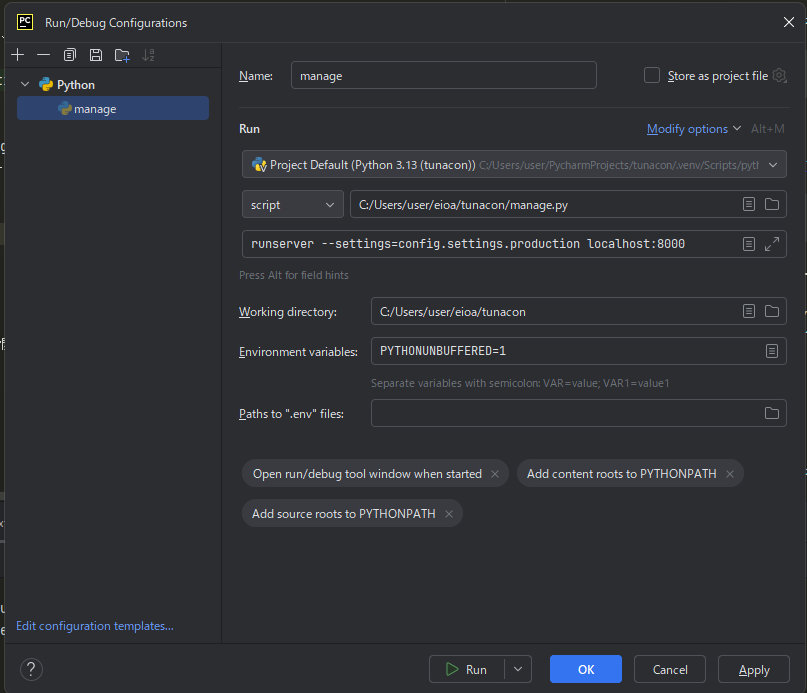

# 環境構築手順

このガイドでは、Python 3.13.1、PyCharm Community、Node.jsなどを使った開発環境の構築手順を説明します。

## 前提条件
- Windows
- RAM:16G
- 管理者権限のあるユーザーアカウント

## 手順

### 1. Python 3.13.1のインストール
1. [Python公式サイト](https://www.python.org/downloads/)にアクセスし、Python 3.13.1をダウンロードします。
2. ダウンロードしたインストーラーを実行し、指示に従ってインストールします。

### 2. PyCharm Communityのインストール
1. [PyCharm公式サイト](https://www.jetbrains.com/pycharm/download/)にアクセスし、適切なバージョンのPyCharm Communityをダウンロードします。
2. ダウンロードしたインストーラーを実行し、指示に従ってインストールします。

### 3. Python 3.13.1のインタプリタ設定
1. PyCharmを開き、プロジェクトをロードします。
2. 右上の「Configure Python Interpreter」アイコンをクリックします。
3. 「Add Interpreter」ボタンをクリックし、「System Interpreter」を選択します。
4. インストールされたPython 3.13.1を選択し、OKをクリックします。

### 4. 必要なPythonパッケージのインストール
1. ターミナルを開き、プロジェクトのルートディレクトリに移動します。
2. 以下のコマンドを実行して、`./requirements/base.txt`に記載されているパッケージをインストールします。
   ```sh
   pip install -r ./requirements/base.txt
   ```

### 5. Node.jsのインストール
1. [Node.js公式サイト](https://nodejs.org/)にアクセスし、最新のLTSバージョンをダウンロードします。
2. ダウンロードしたインストーラーを実行し、指示に従ってインストールします。

### 6. 必要なNode.jsパッケージのインストール
1. ターミナルを開き、プロジェクトのルートディレクトリに移動します。
2. 以下のコマンドを実行して、`package.json`に記載されているパッケージをインストールします。
   ```sh
   npm install
   ```

### 7. ビルドの実施
1. 以下のコマンドを実行して、プロジェクトをビルドします。
   ```sh
   npm run build
   ```

### 8. スタティックファイルの収集
1. 以下のコマンドを実行して、スタティックファイルを収集します。
   ```sh
   python manage.py collectstatic
   ```

### 9. PyCharmのRun/Debug Configuration設定
1. PyCharmを開き、プロジェクトをロードします。
2. 画面右上の「Add Configuration」をクリックし、新しい「Django Server」設定を追加します。
3. 以下の設定を行います。

4. 保存して設定を完了します。

### 10. secure.ymlの配置

tsunacon\secure.yml
※ファイルの中身は別途配布

### 11. テーブル作成

```
まだmigrationファイルがないから、makemigrationの実施もする。
そのうちにmigrationファイル自体をコミットしていく。
その時には、コンフリクトを起こしてしまうので、sqliteDBの削除など、手順を記載していく
ひとまず下記のコマンドを実施のこと
python manage.py makemigrations
python manage.py migrations
```

